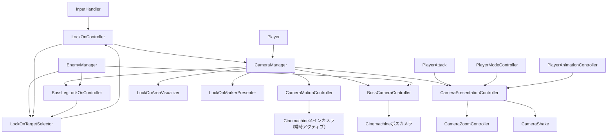

# カメラシステム概要

このフォルダには、常時アクティブな1台のプレイヤー追従カメラ、カメラシェイク、ロックオンUIを構成するクラスが含まれています。カメラは常に「ロックオン対象がいれば追従、いなければスティック/マウス操作によるフリールック」の1状態で動作します（通常/ロックオンで別カメラに切り替える仕組みはありません）。
フリールックは、対象追従と同じ1台のカメラ（`_lockOnCamera`）に付けた `CinemachineOrbitalFollow` / `CinemachineRotationComposer` / `CinemachineDecollider` に完全に委ねています（元々別カメラ「FreeLook Camera」に付いていたコンポーネントをそのまま移設したもので、3段リングのオービット・デッドゾーン付きの見た目・障害物回避まで含む本格的な設定です）。ロックオン中はこれら3コンポーネントを無効化し、位置・回転を直接Transformへ書き込むハンドロールドのロジック（`UpdateLockOn`）に切り替えます。1台のカメラの上で「Cinemachineが動かす」「スクリプトが直接動かす」を排他的に切り替える構成のため、両者が同時に有効になることはありません。
ロックオン対象の保持と遷移は `CameraController`（シーン上では互換コンポーネントの `LockOnController` として配置）が担当し、`CameraManager` はカメラ参照の初期化、各サブコントローラーの生成・Tick統括、イベントの委譲を担当します。カメラの位置・回転計算、ロックオン対象の選定、ゲームイベントを受けた演出（ズーム・カメラシェイク）の発火は、それぞれ専用クラスへ分離されています。

将来、探索専用カメラやイベント専用カメラなど別の状態を追加する可能性に備え、状態切り替えの拡張点として `ICameraState` インターフェースは維持しています（現在の実装は `FollowCameraState` の1つのみ）。

> **ドキュメント更新ルール**: クラス間で責務（状態の所有、遷移の実行主体、イベントの発行/購読の向きなど）を移動するリファクタリングを行った場合は、**同じ変更の中で**このドキュメントも更新してください。特に各クラスの担当箇所（`## クラス一覧`）と [参照関係と責務の境界](#参照関係と責務の境界) の表は実装との食い違いが起きやすい箇所です。実装だけ変更してドキュメントを古いまま残すと、後から読む人（人間・AI問わず）が誤った前提でコードを触ってしまいます。

## クラス一覧

### CameraManager

カメラシステムの初期化・更新統括を担当する`MonoBehaviour`です。シーン上に配置され、次の処理を担当します。

- メインカメラ（`_lockOnCamera`。常時アクティブ）・ボスカメラの参照保持、Priorityの初期設定と `SetLockOnCameraActive` / `SetBossCameraActive` による切り替え。Priorityは既定で メイン(`_normalPriority`=10) < ロックオン中(`_lockOnPriority`=20) < ボス(`_bossPriority`=30) の順で、ボス戦中は常にボスカメラが最前面になるよう設計されている。ただし `SetLockOnCameraActive(true)` は `_bossBodyCamera` が設定されている場合、メインカメラのPriorityを `_bossPriority + 1` 以上へ引き上げる（ボスの脚/頭など、ボス戦中のロックオンが最前面になるようにするため。これをしないとボスカメラのPriorityが常に勝ち、ロックオン状態になっても視点が全く切り替わらない）
- `CameraMotionController` / `CameraPresentationController` / `BossCameraController` / `CameraController`（`LockOnController`）の生成と初期化引数の受け渡し（`BossCameraController` は `_bossBodyCamera` 設定時のみ）
- 毎 `FixedUpdate` での `CameraPresentationController.Tick` / `CameraController.Tick` / `BossCameraController.Tick` の呼び出し（TimeScaleの伝播を含む）。ボスカメラ有効中でも `CameraController.Tick` は止めない（対象なし時の自動探索＝強制ロックオンをボス戦中でも機能させるため）。共有の追従アンカーへの書き込みが競合しないよう、`BossCameraController.Tick` を必ず後に呼ぶ（ボス側の直接スナップが最後に勝つ）
- `CameraController.OnTargetChanged` を `OnLockOnTargetChanged` として中継
- ゲーム設定によるカメラ位置追従速度・（対象なし時の）フリールック回転速度の反映
- シーン切り替え後のMain Camera再取得
- 外部から `LockOn` / `Unlock` / ズーム操作 / カメラシェイクを呼べる薄い委譲メソッドを提供（実行本体はそれぞれ `CameraController` / `CameraPresentationController`）
- `SetLockOnSuspended(bool)`：ムービー再生中・リザルト表示中など、ロジック側の都合でロックオンを一時停止/再開させる薄い委譲メソッド。`CameraController.SetLockOnSuspended` を呼び、再開時（`false`）は`CameraMotionController.ResetFreeLookBehindPlayer` でフリールックの姿勢もプレイヤー基準へ合わせ直す

カメラの位置・回転計算（対象追従／対象なし時のフリールック）は `CameraMotionController` に委譲します。
ロックオン対象の保持・遷移は `CameraController` に、ゲームイベントを受けた演出の発火は `CameraPresentationController` に委ねています。

### CameraPresentationController

ゲームイベント（チャージ、モード変更など）を受けてカメラの演出（ズーム・カメラシェイク）を発火する専用クラスです。`MonoBehaviour` ではなく、プレイヤー初期化時に `CameraManager` が生成します。カメラの参照・Priority・ライフサイクル管理は行わず、演出の発火条件と内容だけを持ちます。

- `PlayerAttack` のチャージ関連イベント（`OnChargeLevelReached` / `OnChargingEnded`）を購読し、`CameraZoomController` のズーム倍率に変換
- `PlayerModeController.OnModeChanged` を購読し、雷神モードへの切替時にズームインし、続けて演出中用の倍率（`MidMultiplier`）へゆっくり寄せる（`SetZoomSequence`で連結。演出終了までに到達すればそこで停止する）
- `PlayerAnimationController.OnModeChangeComplete`（モードチェンジ演出の終了通知）を受けて、その時点の倍率から通常視野へ戻す。ズームアウトのタイミングは固定時間ではなく演出の実際の終了に同期する
- `CameraShake` を使ったカメラシェイクの開始・強制停止（対象カメラの選択は `CameraManager` が行い、引数として受け取る）
- `CameraZoomController` を生成・保持し、毎フレームの補間（`Tick`）を実行

`ChargeZoomSetting`（チャージ段階到達時の倍率と到達時間）、`ReleaseZoomSetting`（チャージ解放時のオーバーシュート設定）、`ModeChangeZoomSetting`（モード変更時のズーム設定: `Multiplier`/`ZoomInDuration`でズームイン、`MidMultiplier`/`MidDuration`で演出中用倍率へ、`ZoomOutDuration`で通常視野へ戻す）はいずれも`CameraPresentationController.cs`内で定義された`[Serializable]`構造体です。Inspector上の実体（`_level2Zoom`等）は`CameraManager`側にフィールドとして持ち、コンストラクタ引数として渡します。

`PlayerAnimationController`はPlayer本体とは別（ネストしたプレハブ上）のGameObjectにあるため、`CameraManager.Init`では`player.GetComponentInChildren<PlayerAnimationController>()`で取得して渡しています。

### CameraMotionController

常時アクティブな1台のカメラ（`_followCamera`。シーン上は旧名の `_lockOnCamera`）の動きだけを担当する内部制御クラスです。`MonoBehaviour` ではなく、プレイヤー初期化時に `CameraManager` が生成します。

- コンストラクタで`_followCamera`（＝`_lockOnCamera`）から`CinemachineOrbitalFollow`・`CinemachineRotationComposer`・`CinemachineDecollider`を`GetComponent`し、`Follow`（TrackingTarget）を内部生成の追従アンカー（`_cameraFollowTarget`）に設定。初期状態はフリールック側を有効化
- 対象なし時（`UpdateFreeLook`）：仮想アンカーの遅延追従（`SmoothDamp`）と、スティック/マウス入力（`InputHandler.CameraMoveInput`）による`CinemachineOrbitalFollow`のAxis値駆動（`HorizontalAxis.Value`に加算、`VerticalAxis.Value`を`VerticalAxis.Range`でクランプしながら加算）。入力が無ければAxis値は変わらない（自動で正面に戻ったりはしない）。実際の位置・回転計算自体（3段リングのオービット、デッドゾーン付きの見た目、障害物回避）は`CinemachineOrbitalFollow`/`CinemachineRotationComposer`/`CinemachineDecollider`が毎フレーム自動で行う（Cinemachine自身の更新経路によるため、`Tick`から明示的に呼ばなくても機能する）
  - 感度は`_freeLookInputDirection`（軸の符号反転）と`_freeLookRotationSpeed`（度/秒、ゲーム設定の「カメラ回転感度」で補正）。マウス/ゲームパッドの感度統一のため、カメラ側の`CinemachineInputAxisController`は使わず、このクラスが`InputHandler.CameraMoveInput`から直接Axis値を書き込む
- 対象あり時（`UpdateLockOn`）：`EnterLockOn`でフリールック用3コンポーネントを無効化してから、位置追従と画面上のデッドゾーン判定に基づく回転を直接Transformへ書き込む（従来通りのハンドロールド実装）
- ロックオン開始時の位置・回転ブレンド（`BeginLockOnBlend` / `UpdateBlend`）
  - 起点：初回ロックオンは**現在実際に表示されているカメラ**（`FollowCameraState` が保持する `_mainCamera`＝Cinemachine Brainの出力Camera）の姿勢へスナップしてから、対象切り替えは現在のカメラ姿勢から。判定は `CameraController.LockOn` が `wasLockedOn` から求め `FollowCameraState.SetTarget(target, isInitialLockOn)` で渡す。ボス戦中はこのカメラのTickが止まり姿勢が古いまま固定されるため、実際の表示カメラをスナップ元にしている（`BeginLockOnBlend` の `currentMainCamera` 引数。未指定時のみ `_followCamera` 自身にフォールバック＝実質スナップなし）
  - 補間：位置・回転ともイージング目標（`_lockOnBlendDuration` で到達）へ寄せつつ、移動を `_lockOnBlendMaxLinearSpeed`（m/秒）、回転を `_lockOnBlendMaxAngularSpeed`（度/秒）でクランプ。対象が近ければ上限に当たらず従来と同じ
  - 終了：位置・回転が収束したら完了。上限で間に合わなければ延長し、`_lockOnBlendDuration + _lockOnBlendMaxExtraTime` 超過で強制終了
  - 対象を解除する際（`FollowCameraState.ClearTarget`）は必ずブレンドをキャンセルし（`CancelLockOnBlend`）、`ExitLockOn`で`CinemachineOrbitalFollow`のAxis値を現在のカメラ姿勢へ同期してからフリールック用3コンポーネントを再有効化する（解除直後に古い向きへ飛ばないようにするため）
- ゲーム設定変更後の位置追従・フリールック回転速度の更新（`SetFreeLookSettings`）
- `ResetFreeLookBehindPlayer`：フリールックの追従アンカーとOrbitalFollowのAxis値をプレイヤーの現在位置・向き基準へ強制的に合わせ直す。ロックオン一時停止中（`CameraController.SetLockOnSuspended(true)`）はこのカメラがCinemachine上非ライブになり得て姿勢更新が保証されないため、`CameraManager.SetLockOnSuspended(false)`（再開時）に呼び、古い姿勢のまま急に映るのを防ぐ

コンストラクタは用途別にまとめた3つの構造体（`CameraReferences` / `FreeLookSettings` / `LockOnSettings` / `LockOnBlendSettings`。いずれも`CameraMotionController.cs`内で定義）を受け取ります。`CameraManager`のInspectorフィールドはフラットな個別フィールドとして保持され、`Init()`内でこれらの構造体へ詰め替えられます。

ロックオン対象の有効性、距離、現在のロックオン状態は保持せず、`CameraManager` から更新指示と対象Transformを受け取ります。

このカメラがFollowするプレイヤー追従アンカー（内部生成の `CameraFollowTarget`）は `FollowAnchor` プロパティで公開しており、`BossCameraController` がボスカメラのFollowにそのまま流用します。ボスカメラ有効中も `CameraMotionController` はアンカーを更新し続けますが（フリールック時は`_positionSmoothTime`でSmoothDamp）、`BossCameraController` はスムージング無しで直接プレイヤー位置へスナップしたい（滑らかさはオービット側で別途かける）ため、`CameraManager.FixedUpdate` の呼び出し順で `BossCameraController.Tick` を後に呼び、ボス側の値を必ず最後に勝たせています。

### BossCameraController

ボス戦中だけ有効化する専用カメラの制御クラスです。`MonoBehaviour` ではなく、`_bossBodyCamera` が設定されている場合のみプレイヤー初期化時に `CameraManager` が生成します。ボス側からは `IEnemy` / `IBossEnemyCharacterView`（`OnChangedPosture`）と、ボスの子階層に置かれた `CameraAnglePoint` だけを参照します（ボス側のメソッドは呼ばず、購読のみ）。

- `EnemyManager.OnEnemySpawned` を購読し、`IEnemy.IsBoss` の敵が出現したらボスカメラを有効化。`OnBossDefeated` / `OnEnemyForceRemoved`（現在のボス）で無効化
- 有効化時：`_bossBodyCamera` の Follow に `CameraMotionController.FollowAnchor`、LookAt に内部生成の注視プロキシを設定し、水平軸は現在のメインカメラ方位をコピーするのではなく、プレイヤー→ボス方向から直接「反対側」の角度を計算してスナップする（`AlignHorizontalAxisToBossOpposite`）。さらに `CinemachineVirtualCameraBase.CancelDamping(true)` を呼んでから `CameraManager.SetBossCameraActive(true)` でPriorityを最前面へ上げる。`_bossBodyCamera` はシーン上の待機位置（Priorityが低い間の固定座標）から`PositionDamping`付きで追従するため、`CancelDamping`を挟まずに有効化すると、待機位置から正しい位置まで減衰移動する様子がそのまま映り込んでしまう
- 注視（体をむく）：ボスの子から `CameraAnglePoint`（`Top`＝頭側 / `Under`＝足元側）を集め、プレイヤー↔ボス距離を `_bossFramingNearDistance`〜`_bossFramingFarDistance` で 0..1 に正規化し、その比率で注視プロキシを `Under`→`Top` で線形補間（`Near`以下＝足元、`Far`以上＝頭）。アンカーが無ければ `IEnemy.GetTargetCenter()` へフォールバック
- カメラの定位置：プレイヤー→ボス方向から求めた方位角（プレイヤーから見てボスの反対側にカメラが来る角度）へ、`CinemachineOrbitalFollow.HorizontalAxis` を `_bossOrbitTrackSpeed`（度/秒）で追従させる。プレイヤー・ボスが動くたびに毎フレーム再計算するので、カメラは常にボスへ正対する側へ収束する（vcam の `CinemachineInputAxisController` は無効化し、このオービット自体は入力で動かさない）
- 左右スイベル：`InputHandler.CameraMoveInput.x` で注視プロキシをカメラ右方向へ `_bossSwivelRange`（m）を上限に `_bossSwivelSpeed` でオフセットし、入力が無ければ `_bossSwivelReturnSpeed` で中央へ戻す。オービット位置は動かさず注視点だけをずらすため、カメラは大きく回り込まずボスを画面内に保ったまま少しだけ振れる
- 体制連動ズーム：`IBossEnemyCharacterView.OnChangedPosture` を購読し、`_bossPostureZooms`（`BossPostureZoom[]`：`PostureType`→倍率・到達時間）から一致するエントリを引いて `CameraManager.SetBaseZoom`（＝ズームのベース層）に流す。一致が無ければ何もしない。チャージ・モード変更のエフェクトズームはこのベース倍率の上に掛かる（実FOV = 基準FOV × ベース × エフェクト）。姿勢の現在値getterは無いため、有効化時は `Standing` 想定でベースズームを当て以降はイベントで補正する。`CameraZoomController` が `_bossBodyCamera` のFOVも書き換えるので、ボスカメラがアクティブでも倍率が反映される
- スポーンイベントは既存ボス数を確認しないため、`HandleEnemySpawned` は毎回 `UnsubscribePosture()` してから購読し直す（旧ボスの姿勢変化が `SetBaseZoom` を呼び続けるのを防ぐ）
- 無効化時：Priorityを待機位置へ戻し、`CameraManager.SetBaseZoom(1, ...)` でベース層だけ等倍へ戻す（エフェクト層はそのまま）

切り替えブレンドは Cinemachine Brain（[Assets/Data/Main Camera Custom Blends.asset](../../Data/Main%20Camera%20Custom%20Blends.asset)）に任せ、ロックオン用のイージング（`BeginLockOnBlend`）は使いません。チューニング値はすべて `CameraManager` の `[SerializeField]`（`_bossXXX`）から `BossCameraSettings` 構造体（`BossCameraSettings.cs`）へ詰め替えて渡します。

`'**ANY CAMERA**' → BossCamera` は `Style: Cut` で登録済みだが、ボス登場ムービー（`BossIntroMovieState`、`Assets/TimeLine/BossIntroMovie.playable` の Cinemachine Track）が終わってから `BossCameraController.Activate()` が呼ばれるまでには数フレームの間隔があり、その間 Brain は一旦ムービー用vcamから`LockOnCamera`へ戻る。ここに個別のカット指定が無いと Brain の `DefaultBlend`（2秒イージング）が使われてしまい、「ムービーの位置から正しい位置へゆっくり動く」ように見える。

これに対処するため、`Assets/Prefab/CatSceneAsset/BossIntroMovieAssets.prefab` 内のムービー専用vcam（元は全て同名`CinemachineCamera`だったため`BossIntroCam_01`〜`_08`へリネーム済み）ごとに、`BossIntroCam_0X → LockOnCamera: Style Cut` を個別登録している。`'**ANY CAMERA**' → LockOnCamera` のような包括的なワイルドカードにはしていない（他の場面でLockOnCameraへ入ってくる別のカメラ、例えばリザルトから戻る場合などのブレンドまで巻き込んで一律カットになってしまうため）。`'FreeLook Camera ' → LockOnCamera` の既存の0.2秒ブレンドは、より具体的な組み合わせとして優先されるため影響しない。

同じ構造の問題が、ゲーム開始時の導入ムービー（`IntroMovieState`、`Assets/TimeLine/IntroMovie.playable` → `MobAndSkill` へ遷移）でも発生する。`Assets/Prefab/CatSceneAsset/IntroMovieAsset.prefab` 内のムービー専用vcamは元々 `CinemachineCamera (1)`〜`(6)`（Unityの自動採番で既に一意）だったため、リネームはせずそのまま `CinemachineCamera (1)`〜`(6) → LockOnCamera: Style Cut` を追加している。対処しないと、モブ戦開始直後にムービー最後のカット（見下ろし構図など）から `LockOnCamera` へ`DefaultBlend`の2秒イージングで戻ってしまい、一瞬不自然な見下ろし姿勢を経由して見える。

### BossLegLockOnController

ボスの右足/左足/頭を、通常の `LockOnTargetSelector` の選定基準（画面中心近さ・プレイヤー距離など）に乗せてロックオンできるようにする候補プロバイダです。`MonoBehaviour` ではなく、`CameraManager.Init` 時に生成され、`LockOnTargetSelector.SetExternalCandidateSource` へ接続されます。Boss側のスクリプト・プレハブは一切変更せず、既存の公開APIだけを参照します。

- `EnemyManager.OnEnemySpawned` でボス出現を検知し、`IBossEnemyCharacterView.ActiveBossEnemyPartsView`（既存公開API）から鎧の装着部位（`ArmorAttachmentType.RightLeg` / `LeftLeg`）で右足・左足パーツを特定して `BossArmorView`（`.IsBroken`）とTransformを保持する
- 頭のロックオン中心は、ボス子階層に既にある `CameraAnglePoint`（`AnglePoint == Top`。`BossCameraController` が注視に使うものと同じコンポーネント）のTransformをそのまま流用する
- 毎Tickで右足/左足の鎧の `IsBroken` を見て、右足/左足/頭それぞれの `IsLockable` を再計算するだけ（右足鎧が生きていれば右足ロック可、両足とも壊れていれば頭のみロック可）。`LockOnTargetSelector` 側は候補を取得するたびに `IsLockable` をその場で見るだけなので、`EnemyManager._lockOnTargets` への登録操作は不要
- `OnBossDefeated` / `OnEnemyForceRemoved`（現在のボス）で候補をクリアする

候補として提供する3つの対象（`BossPartLockOnTarget`）は、`BossCharacterPartsView` 等のBoss側クラスに依存しない、Camera側だけで完結する軽量な `ILockOnTarget` 実装です。対象の選定自体（スコア計算・切り替え・自動解除）は一切変更せず、既存の `LockOnTargetSelector` / `CameraController.TryHandleInvalidTarget` の仕組みにそのまま乗ります（現在ロック中のパーツが `IsLockable = false` になれば、既存の仕組みが自動で次の候補へ切り替えます）。

**`ShouldExcludeFromDefaultPool`**: ボス本体は姿勢(Posture)が変わるたびに `BossCharacterView.ChangeLockOnParts` が独自に `BossCharacterPartsView`（腕/脚/胴体の弱点パーツ）を `EnemyManager._lockOnTargets` へ登録・解除しており、これは鎧の生死ではなく姿勢（AIのビヘイビアツリーが決定）に連動する、本クラスとは無関係な既存の仕組みです。これをそのままにすると、右足/左足/頭の3候補と役割が重複し、かつ鎧が壊れても`IsLockable`が変わらない古い候補が混ざって意図しない対象（姿勢によっては腕や胴体の弱点パーツ）へ切り替わってしまいます。そのため `LockOnTargetSelector.SetDefaultPoolExclusion` 経由で `BossCharacterPartsView` 型の候補を常に除外し、ボスの部位ロックオンは本クラスが供給する3対象だけに一本化しています。

### CameraZoomController

メインカメラ（`_lockOnCamera`）・ボスカメラ（`_bossBodyCamera`、未設定シーンではnull可）のField of Viewをまとめて補間するズーム専用クラスです。`CameraPresentationController` が生成し、チャージ段階やモードといったゲーム側の意味は一切知りません。倍率と時間だけを扱う低レベルな補間エンジンです。2台とも毎フレーム FOV を書き込むため、どちらがアクティブでもズームが効きます。

倍率は**ベース層とエフェクト層の2段**で、実FOV = `基準FOV × ベース倍率 × エフェクト倍率`。それぞれ独立に時間ベース補間します。

- **ベース層**（`SetBaseZoom(zoom, duration)`）：基準そのものを動かす用途。ボスの体制連動ズームがここ。ボス戦外は常に1
- **エフェクト層**（`SetZoom` / `SetZoomSequence` / `ZoomIn` / `ZoomOut` / `ResetZoom`）：基準に対して一時的に掛ける用途。チャージ段階・チャージ解放・モード変更がここ。`ResetZoom`（や解放シーケンスの settle 目標「1」）はエフェクト層を1へ戻す＝ベース（体制）倍率へ戻る

ズーム値は基準FOVに対する**直接の倍率**です。1.0で変化なし、1未満でズームイン（画角が狭まる）、1より大きい値でズームアウト（画角が広がる）。補間の中間値のみ`Lerp`を使用します。

- `Tick(deltaTime)`: ベース・エフェクト両層を目標へ補間し、その積をカメラのFOVへ反映する。`CameraPresentationController.Tick`から毎フレーム呼ばれる
- `CurrentZoom`: 実効倍率（ベース×エフェクト）を返す

チャージ段階（`SetZoomLevel`）・チャージ解放・モード変更をFOV倍率へ変換する判断ロジックは `CameraPresentationController` 側が持ちます。

### CameraController / LockOnController

`CameraController` は**ロックオン対象の遷移を担当する実行主体**です。常時アクティブな `_cameraState`（`FollowCameraState` 1つのみ。`ICameraState` 実装）を保持し、`LockOn` / `Unlock` では対象の設定・解除だけを行います（カメラそのものの切り替えは発生しない）。既存Prefabの参照を維持するため、現在のシーン上のコンポーネント型は `LockOnController : CameraController` として残しています。

- `_cameraState`（`FollowCameraState`）の保持。`LockOn` は `SetTarget`、`Unlock` は `ClearTarget` を呼ぶだけで、状態そのものの遷移（Enter/Exit呼び直し）は発生しない
- `Tick` 内の `TryHandleInvalidTarget` で対象を監視：対象が無効化（撃破・削除・非ロック化）されたら次の対象へ、いなければ`Unlock`。通常の敵撃破はこの経路で拾う（`OnEnemyDefeated` は購読しない）。距離による自動解除は行わない
- `Unlock`は「ロックオンをやめる」選択肢が無い（対象がいる限り強制ロックオンの）設計なので、呼ばれると必ず`_isSearchingForTarget`を立てて再探索を再開する。呼び出し元（`TryHandleInvalidTarget`／`HandleEnemyForceRemoved`／`CameraManager.SetBossCameraActive`）は再探索の有無を個別に意識しなくてよい。特に`SetBossCameraActive(true)`はボス出現時に既存のロックオン対象を強制解除するが、この仕組みにより解除直後から自動でボスの脚/頭への再ロックオンが機能する
- `SetLockOnSuspended(bool)`：プレイヤー操作でロックオンをOFFにする手段は無い（常に強制探索）ため、ロジック側（`SequenceState`）が「ロックオンが働くと不都合な間」だけ自動探索・切り替え入力を止めるための唯一の抑止経路。`true`で停止（ロックオン中なら`Unlock`してから停止）、`false`で`_isSearchingForTarget`を立てて再探索を再開する。停止中は`Tick`が丸ごと早期returnする。`IntroMovieState`／`BossIntroMovieState`／`ResultState`が`OnEnter`/`OnExit`で呼ぶ（`CameraManager.SetLockOnSuspended`経由）
- `_isSearchingForTarget`（ロックオンしたい意思を表すフラグ。初期値`true`）が立っている間、`Tick`は未ロックオン中でも毎回`SelectInitialTarget`を試み、見つかれば`LockOn`で通常の初回ロックオンと全く同じ手順（ブレンド含む）で再突入する。初期値がtrueなので**起動直後で一度もロックオンしていない状態でも**、敵がいれば確実にロックオンする。`LockOn`成功時にフラグをクリアする
- ロックオンは対象がいる限り強制。`HandleLockOnInput`はロックオン中は何もしない（`IsLockedOn`なら早期return）ため、ロックオンボタン（右クリック等）を押してもロックオン⇔フリールックを手動で切り替えることはできない。未ロックオン時のみ`TryManualLockOn`で手動ロックオンを試みる（実際は`_isSearchingForTarget`の自動探索が同じことを毎Tickやっているため、ボタンでの手動トリガーはほぼ補助的）
- 対象切り替え判定（`Tick` 内の `UpdateTargetSwitch`）。**1入力につき1回だけ**切り替える（意図しない連続切り替えを防ぐ）
  - スティック：横成分が `_switchStickOnThreshold` を超えたら1回切り替え。`_switchStickOffThreshold` 以下に戻るまで再切り替えしない（ヒステリシス）
  - マウス：連続した横スワイプの移動量が `_switchMouseThreshold` を超えたら1回切り替え。有意な移動（1フレーム `_switchMouseMinStep` px 以上）が `_switchMouseIdleTime` 秒ないとスワイプ終了とみなし蓄積をリセット。逆方向へ振り直しても再武装。スワイプ終了の判定は per-Tick ではなく時間で行う（低FPSで Update が挟まらない Tick でも誤ってリセットしない）
  - ロックオン開始時はラッチ未武装で始め、入力がニュートラルに戻ってから受け付ける
- `EnemyManager.OnEnemyForceRemoved` を購読し、削除されたのが現在の対象なら次へ切り替え（なければ解除）
- 遷移結果を `CameraManager.SetLockOnCameraActive` でPriorityへ反映し、`OnTargetChanged` で `CameraManager` へ通知
- `SetExternalLockOnCandidateSource` / `SetLockOnDefaultPoolExclusion` で `LockOnTargetSelector` へ外部候補ソース・除外条件（`BossLegLockOnController` 等）を設定する薄いパススルーを提供

対象切り替えの入力は `Gamepad.current.rightStick` と `Mouse.current.delta` を直接参照します（変更を Camera フォルダ内に閉じるための割り切り。`InputHandler` は経由しない）。マウス横移動量は取りこぼし防止のため `Update` でフレーム精度で蓄積し `Tick` で消費します。ただし**ヒットストップ中（`CameraManager.TimeScale ≈ 0` で `Tick` が止まる間）は蓄積せずゼロクリア**します。溜め込むと再開フレームで一括放出され、意図しない対象切り替え（撃破の瞬間に無関係な敵へロックオンが飛ぶ）が起きるためです。スティック・マウスとも入力がニュートラルに戻った Tick で蓄積・ラッチを初期化します。閾値は `CameraController` の `[SerializeField]`（`_switchStickOnThreshold` / `_switchStickOffThreshold` / `_switchMouseThreshold` / `_switchMouseMinStep` / `_switchMouseIdleTime`）で調整します。

このクラス自身は画面上の位置や角度から候補を比較しません（`LockOnTargetSelector` に委譲）。カメラの位置・回転計算も `CameraMotionController` に委譲します。状態変更は `CameraManager` へイベント通知のみで伝えます。

### LockOnTargetSelector

ロックオン候補の取得と、候補の中から対象を選ぶ純粋な選定ロジックを担当します。`MonoBehaviour` ではなく、`LockOnController.Init` 時に生成されます。

候補は `EnemyManager.GetLockOnTarget` に加え、`SetExternalCandidateSource`（`CameraController.SetExternalLockOnCandidateSource` 経由。`CameraManager` が `BossLegLockOnController` を接続する）で設定した外部ソースからも取得し、次の条件で絞り込みます。

- ロックオン可能である
- ターゲット中心のTransformが存在する
- プレイヤーからロックオン可能距離（`_lockOnRange`）以内である（外部ソースの候補にも同じ距離条件を適用する）
- `SetDefaultPoolExclusion` で設定した除外条件に一致しない（`EnemyManager` 由来の候補のみに適用。外部ソースの候補が担う役割と重複するものを弾く用途。`CameraManager` は `BossLegLockOnController.ShouldExcludeFromDefaultPool` を接続し、ボス本体の姿勢(Posture)連動パーツ〈`BossCharacterPartsView`〉を除外する。詳細は後述の `BossLegLockOnController` の節を参照）
- 必要に応じて現在の対象を除外する

遮蔽は選定に使いません。画面内外も足切りしません（画面外の候補はスコアで自然に後回しになる）。

### 選定スコア（`Score`。小さいほど優先。同スコアはリスト順で先勝ち）

3項を 0..1 に正規化して加重合算します。重みは `CameraController` の `[SerializeField]` から `LockOnScoreWeights` として渡します。

| 項 | 計算 | 重み |
| --- | --- | --- |
| 画面中心ズレ | カメラ前方と「カメラ位置→対象中心」のなす角 ÷ `CenterAngleReference`（度）を Clamp01 | `_scoreWeightScreenCenter` |
| プレイヤー距離 | プレイヤー〜対象中心の距離 ÷ `_lockOnRange` を Clamp01 | `_scoreWeightPlayerDistance` |
| カメラ側ペナルティ | 水平面で `dot((対象中心−プレイヤー).normalized, (プレイヤー−カメラ).normalized)`、その符号反転を Clamp01（プレイヤーより手前＝カメラ側の敵だけ 0→1） | `_scoreWeightCameraSide` |

提供する選定方法は次の3つです。

- `SelectInitialTarget`: 初回ロックオン。全候補からスコア最小の対象を選びます。
- `SelectSwitchTarget`: 切り替え入力による対象変更。カメラ前方に映っている（`WorldToScreenPoint().z > 0`）候補のうち、画面X座標が現在対象より入力方向側にあるものから、スコア最小の対象を選びます。方向側に候補がなければ何もしません。
- `SelectNextTarget`: 現在対象が撃破・削除された後の次対象を選びます。初回選択と同じスコアを使います。

`SelectSwitchTarget` の左右判定にはカメラの `WorldToScreenPoint` を使用します。

### CameraShake / CameraShakeData

`CameraShake` はCinemachineの `CinemachineBasicMultiChannelPerlin` を操作し、一定時間だけカメラにノイズを加えます。

- `CameraShakeData`: 振幅、周期、持続時間をまとめたシリアライズ可能な設定値
- `StartCameraShake`: 対象カメラのNoiseコンポーネントを取得し、指定値でシェイクを開始
- `ForceStopCameraShake`: 実行中のシェイクをキャンセルし、Noiseの値をゼロに戻す
- 新しいシェイクを開始すると、実行中のシェイクを停止してから置き換えます

処理時間の待機にはUniTaskとCancellationTokenを使います。`CameraManager` がボスカメラ有効中かどうかでボスカメラかメインカメラ（`_lockOnCamera`）を選び、`CameraPresentationController` 経由で渡します。

### LockOnAreaVisualizer

ロックオン判定のデッドゾーンを画面中央の円として表示するUIコンポーネントです。

- `CameraManager.LockOnAreaRadius` を直径に変換してUIサイズへ反映
- 未ロックオン時とロックオン時で表示色を変更
- `_showArea` による表示・非表示
- 必要なCanvas、Image、円形Spriteを実行時に生成
- エディタ上でも値変更時に円のサイズを更新

ロックオン判定そのものは行わず、`CameraManager` が持つ設定値と状態を表示するだけです。

## 主要な連携

## ロックオン開始から解除まで

対象がいない間、カメラはスティック/マウス操作によるフリールックです（`FollowCameraState.Tick` → `CameraMotionController.UpdateFreeLook`）。ロックオン開始・切り替え・解除は、この同じカメラの追従先を切り替えるだけの操作です。

`_isSearchingForTarget` の初期値が `true` なので、**ロックオンボタンを押さなくても**、ロック可能な敵が存在する限り起動直後から自動でロックオンします（下記8番の経路）。ボタン入力（1〜3番）は、既に敵がいるのに手動で対象を選び直したい場合や、`_isSearchingForTarget` が明示的解除でfalseになっている場合に使う経路です。プレイヤー操作でロックオンをOFFにする手段は無いため、ムービー再生中・リザルト表示中など自動探索が働くと不都合な場面では、`SequenceState` 側が `CameraManager.SetLockOnSuspended(true/false)` で一時停止/再開します（`IntroMovieState`／`BossIntroMovieState`／`ResultState` が使用）。

1. `InputHandler` がロックオン入力イベントを発行します。
2. `LockOnController`（`CameraController`）が `LockOnTargetSelector.SelectInitialTarget` を呼び出します。
3. `LockOnController` が自身の `LockOn`（`CameraController.LockOn`）を実行し、選ばれた対象を `FollowCameraState.SetTarget` で設定します（カメラの切り替えは発生しない。以後 `Tick` が対象追従の計算へ切り替わるだけ）。
4. `CameraManager.SetLockOnCameraActive(true)` によりメインカメラのPriorityが（ボス戦中はボスカメラより高く）上がり、`SetTarget` 内で開始されたブレンドが進行します。
5. ブレンド完了後、対象の画面位置に応じてカメラを回転し、プレイヤーを基準に位置を追従します。
6. ロックオン中は `CameraController.Tick` 内の `UpdateTargetSwitch` が切り替え入力を判定し、1入力につき1回だけ `SelectSwitchTarget` で対象を切り替えます。
7. `CameraController.Tick` 内の `TryHandleInvalidTarget` が対象を監視します。対象が無効化（撃破・削除・`IsLockable=false` 化）されたら `SelectNextTarget` で次へ切り替え、いなければ解除して`_isSearchingForTarget`を立てます。対象でない敵の撃破では何も起きません。`OnEnemyForceRemoved` のみイベント購読で、現在の対象が削除されたときだけ同様に処理します。距離による自動解除は行いません。
8. `_isSearchingForTarget` が立っている間は未ロックオン状態でも毎Tick `SelectInitialTarget` を試み、新しい候補が見つかれば通常のロックオン開始と同じ手順（ブレンド含む）でそのまま再突入します。プレイヤーが明示的にロックオンボタンで解除した場合はこの再探索を行いません。
9. `CameraController.Unlock` が `FollowCameraState.ClearTarget` を呼び、対象を外してブレンドをキャンセルし、`ExitLockOn`で`CinemachineOrbitalFollow`のAxis値を現在のカメラ姿勢へ同期してからフリールック用3コンポーネントを再有効化します。以後 `Tick` は次のフレームからフリールック（Cinemachine任せ）に戻り、外れた瞬間の向きからそのまま手動操作を継続できます。`CameraManager.SetLockOnCameraActive(false)` によりPriorityが基準値へ下がります。

ボスの脚/頭（`BossLegLockOnController` が供給する候補）も、上記と全く同じ流れでロックオンされます。`CameraManager.FixedUpdate` はボスカメラ有効中でも `CameraController.Tick` を止めないため、ボス戦中でも対象なし時の自動探索・ロックオン開始後の対象切り替えとも通常どおり機能します。

## 参照関係と責務の境界

| クラス | 主な責務 | 主な依存先 |
| --- | --- | --- |
| `CameraManager` | 初期化・Tick統括・イベント委譲・ライフサイクル | Cinemachine、Player、InputHandler、CameraController、CameraMotionController、CameraPresentationController、BossLegLockOnController |
| `CameraMotionController` | 常時アクティブな1台のカメラの位置・回転、ブレンド。対象なし時は`CinemachineOrbitalFollow`/`RotationComposer`/`Decollider`のAxis値を駆動するだけでCinemachine本体に処理を委ね、対象あり時はこれらを無効化してTransformを直接操作する。追従アンカーを `FollowAnchor` で公開 | Cinemachine、Player、InputHandler（`CameraMoveInput`を引数で受け取るのみ） |
| `BossCameraController` | ボス戦中の専用カメラ（定位置のボス正対追従・注視点の左右スイベル・姿勢連動ズーム）の有効化と駆動 | Cinemachine、EnemyManager（Spawned/BossDefeated/ForceRemoved）、InputHandler、CameraManager、CameraAnglePoint、IBossEnemyCharacterView（OnChangedPosture） |
| `BossCameraSettings` | `BossCameraController` へ渡すチューニング値の組（`CameraManager` の Inspector 値から詰め替え） | なし |
| `BossLegLockOnController` | ボスの右足/左足/頭をロックオン候補として供給（鎧の生死で `IsLockable` を切り替えるだけ） | EnemyManager（Spawned/BossDefeated/ForceRemoved）、IBossEnemyCharacterView（ActiveBossEnemyPartsView）、BossArmorView（IsBroken）、CameraAnglePoint |
| `CameraPresentationController` | ゲームイベントを受けた演出（ズーム・カメラシェイク）の発火 | CameraZoomController、CameraShake、PlayerAttack、PlayerModeController、PlayerAnimationController |
| `CameraZoomController` | FOV倍率の時間ベース補間。ベース層（体制連動）×エフェクト層（チャージ等）の2段を通常・ロックオン・ボスの3カメラへ毎フレーム適用 | Cinemachine |
| `CameraController` | ロックオン状態の保持、対象の遷移・自動解除判定、切り替え入力 | InputHandler、EnemyManager（ForceRemovedのみ）、LockOnTargetSelector、CameraManager、Unity Input System（Gamepad/Mouse直接参照） |
| `LockOnController` | 既存Prefab向けの互換コンポーネント | CameraController |
| `LockOnTargetSelector` | ロックオン候補の絞り込みと選定（EnemyManager＋外部候補ソースをマージ） | EnemyManager、Camera、Player、外部候補ソース（BossLegLockOnController 等） |
| `CameraShake` | Cinemachine Noiseの一時操作 | Cinemachine、UniTask |
| `LockOnAreaVisualizer` | デッドゾーンの画面表示 | CameraManager、Unity UI |
| `ILockOnTarget` | ロックオン対象の共通契約 | 実装側のターゲット中心Transform |

## 実装上の注意

- シーン上の初期化順に依存するため、`CameraManager.Init(Player)` が呼ばれてからロックオン入力を扱える状態になります。
- `CameraManager` はメインカメラ（`_lockOnCamera`）・ロックオンコントローラーの参照が不足すると初期化を中断します。
- `InputHandler.CameraMoveInput`（`CameraMove` アクション）は2箇所から参照されます：メインカメラ側（`FollowCameraState.UpdateFreeLook`、対象なし時のみ）と、`BossCameraController`の左右スイベル操作（ボスカメラ有効時、注視点オフセット）。`CameraManager.FixedUpdate`は`CameraController.Tick`を常に呼ぶため、ボス戦中かつ未ロックオン（探索中）の間はどちらも同時に動きえます。
- `CameraController.SetLockOnSuspended(true)` の間は `Tick` が丸ごと早期returnするため、`FollowCameraState.UpdateFreeLook` も止まります（フリールックの位置追従・回転が更新されない）。ムービー再生中などカメラが非表示の間だけ使う想定で、表示中のカメラに対して呼ぶと入力を受け付けなくなります。
- `LockOnController` は `EnemyManager.OnEnemyForceRemoved` と `InputHandler.OnLockOn` を購読するため、`OnDestroy` での購読解除が必要です。
- `LockOnTargetSelector` は選定スコアと左右判定に `_camera`（Cinemachine Brain 出力のメインカメラ）の `transform` と `WorldToScreenPoint` を使うため、カメラが未準備の場合は正しく選定できません。
- 対象切り替えは `CameraController` が `Gamepad.current.rightStick` と `Mouse.current.delta` を直接参照します（`InputHandler` を経由しない割り切り）。`LockOnChange` アクションや矢印キーは対象切り替えには使いません。
- `LockOnController.cs` はクラス名とファイル名を一致させています。Unityスクリプトをリネームする場合は、既存のMetaファイルのGUIDを維持してください。
- `BossLegLockOnController` は、ボスの`ActiveBossEnemyPartsView`（初期姿勢＝`Standing`時点）に右足・左足の鎧付きパーツが含まれていることを前提にしています。ボス側で姿勢（Posture）が `Standing` 以外に切り替わっても、一度取得した `BossArmorView`／Transform参照はそのまま保持し続けるため、脚パーツ自体が破棄されない限り機能し続けます。該当パーツが見つからない場合は警告ログを出して脚/頭ロックオンを無効化します。
- フリールックの`CinemachineOrbitalFollow`/`CinemachineRotationComposer`/`CinemachineDecollider`は、元は別カメラ「FreeLook Camera」に付いていたコンポーネントを`_lockOnCamera`のGameObjectへ移設したものです（値はCopy Component/Paste Component As Newでそのまま引き継いでいるため再チューニング不要）。空になった元の「FreeLook Camera」GameObjectはシーン上に残っていても参照されないため、削除して構いません。
- 上記3コンポーネントの`enabled`切り替え（`CameraMotionController.EnterLockOn`/`ExitLockOn`）は、ロックオン中に直接Transformを書き込むハンドロールド処理とCinemachine自身の更新が同時に同じTransformへ競合しないようにするための排他制御です。両方を同時に有効化しないこと。
