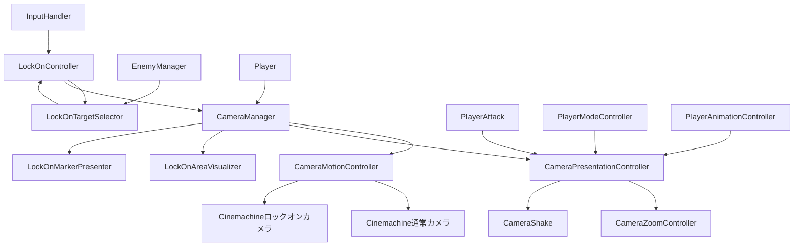

# カメラシステム概要

このフォルダには、通常時の追従カメラ、ロックオンカメラ、カメラシェイク、ロックオンUIを構成するクラスが含まれています。
ロックオン状態（通常/ロックオン中）の保持と対象の遷移は `CameraController`（シーン上では互換コンポーネントの `LockOnController` として配置）が担当し、`CameraManager` はカメラ参照の初期化、各サブコントローラーの生成・Tick統括、イベントの委譲を担当します。カメラの位置・回転計算、ロックオン対象の選定、ゲームイベントを受けた演出（ズーム・カメラシェイク）の発火は、それぞれ専用クラスへ分離されています。

> **ドキュメント更新ルール**: クラス間で責務（状態の所有、遷移の実行主体、イベントの発行/購読の向きなど）を移動するリファクタリングを行った場合は、**同じ変更の中で**このドキュメントも更新してください。特に各クラスの担当箇所（`## クラス一覧`）と [参照関係と責務の境界](#参照関係と責務の境界) の表は実装との食い違いが起きやすい箇所です。実装だけ変更してドキュメントを古いまま残すと、後から読む人（人間・AI問わず）が誤った前提でコードを触ってしまいます。

## クラス一覧

### CameraManager

カメラシステムの初期化・更新統括を担当する`MonoBehaviour`です。シーン上に配置され、次の処理を担当します。

- 通常カメラとロックオンカメラの参照保持、Priorityの初期設定と `SetLockOnCameraActive` によるロックオン時の切り替え
- `CameraMotionController` / `CameraPresentationController` / `CameraController`（`LockOnController`）の生成と初期化引数の受け渡し
- 毎 `FixedUpdate` での `CameraPresentationController.Tick` / `CameraController.Tick` の呼び出し（TimeScaleの伝播を含む）
- `CameraController.OnTargetChanged` を `OnLockOnTargetChanged` として中継
- ゲーム設定によるカメラ移動速度・回転感度の反映
- シーン切り替え後のMain Camera再取得
- 外部から `LockOn` / `Unlock` / ズーム操作 / カメラシェイクを呼べる薄い委譲メソッドを提供（実行本体はそれぞれ `CameraController` / `CameraPresentationController`）

カメラの位置・回転計算と通常カメラへの角度引き継ぎは `CameraMotionController` に委譲します。
ロックオン状態の保持・遷移、対象の自動解除判定は `CameraController` に、ゲームイベントを受けた演出の発火は `CameraPresentationController` に委ねています。

### CameraPresentationController

ゲームイベント（チャージ、モード変更など）を受けてカメラの演出（ズーム・カメラシェイク）を発火する専用クラスです。`MonoBehaviour` ではなく、プレイヤー初期化時に `CameraManager` が生成します。カメラの参照・Priority・ライフサイクル管理は行わず、演出の発火条件と内容だけを持ちます。

- `PlayerAttack` のチャージ関連イベント（`OnChargeLevelReached` / `OnChargingEnded`）を購読し、`CameraZoomController` のズーム倍率に変換
- `PlayerModeController.OnModeChanged` を購読し、雷神モードへの切替時にズームインし、続けて演出中用の倍率（`MidMultiplier`）へゆっくり寄せる（`SetZoomSequence`で連結。演出終了までに到達すればそこで停止する）
- `PlayerAnimationController.OnModeChangeComplete`（モードチェンジ演出の終了通知）を受けて、その時点の倍率から通常視野へ戻す。ズームアウトのタイミングは固定時間ではなく演出の実際の終了に同期する
- `CameraShake` を使ったカメラシェイクの開始・強制停止（対象カメラの選択は `CameraManager` が行い、引数として受け取る）
- `CameraZoomController` を生成・保持し、毎フレームの補間（`Tick`）を実行

`ChargeZoomSetting`（チャージ段階到達時の倍率と到達時間）、`ReleaseZoomSetting`（チャージ解放時のオーバーシュート設定）、`ModeChangeZoomSetting`（モード変更時のズーム設定: `Multiplier`/`ZoomInDuration`でズームイン、`MidMultiplier`/`MidDuration`で演出中用倍率へ、`ZoomOutDuration`で通常視野へ戻す）はいずれも`CameraPresentationController.cs`内で定義された`[Serializable]`構造体です。Inspector上の実体（`_level2Zoom`等）は`CameraManager`側にフィールドとして持ち、コンストラクタ引数として渡します。

`PlayerAnimationController`はPlayer本体とは別（ネストしたプレハブ上）のGameObjectにあるため、`CameraManager.Init`では`player.GetComponentInChildren<PlayerAnimationController>()`で取得して渡しています。

### CameraMotionController

通常カメラとロックオンカメラの動きだけを担当する内部制御クラスです。`MonoBehaviour` ではなく、プレイヤー初期化時に `CameraManager` が生成します。

- 通常カメラの入力回転と仮想アンカーの遅延追従
- ロックオンカメラの位置追従と画面上のデッドゾーン判定に基づく回転
- ロックオン開始時の位置・回転ブレンド（`BeginLockOnBlend` / `UpdateBlend`）
  - 起点：初回ロックオンは通常カメラ姿勢へスナップしてから、対象切り替えは現在のロックオンカメラ姿勢から。判定は `CameraController.LockOn` が `wasLockedOn` から求め `LockOnCameraState.SetTarget(target, isInitialLockOn)` で渡す
  - 補間：位置・回転ともイージング目標（`_lockOnBlendDuration` で到達）へ寄せつつ、移動を `_lockOnBlendMaxLinearSpeed`（m/秒）、回転を `_lockOnBlendMaxAngularSpeed`（度/秒）でクランプ。対象が近ければ上限に当たらず従来と同じ
  - 終了：位置・回転が収束したら完了。上限で間に合わなければ延長し、`_lockOnBlendDuration + _lockOnBlendMaxExtraTime` 超過で強制終了
- ロックオン解除時の角度を通常カメラへ引き継ぎ
- ゲーム設定変更後の通常カメラ速度更新

コンストラクタは用途別にまとめた4つの構造体（`CameraReferences` / `NormalCameraSettings` / `LockOnSettings` / `LockOnBlendSettings`。いずれも`CameraMotionController.cs`内で定義）を受け取ります。`CameraManager`のInspectorフィールドはフラットな個別フィールドとして保持され、`Init()`内でこれらの構造体へ詰め替えられます。

ロックオン対象の有効性、距離、現在のロックオン状態は保持せず、`CameraManager` から更新指示と対象Transformを受け取ります。

### CameraZoomController

通常カメラとロックオンカメラのField of Viewをまとめて補間するズーム専用クラスです。`CameraPresentationController` が生成し、チャージ段階やモードといったゲーム側の意味は一切知りません。倍率と時間だけを扱う低レベルな補間エンジンです。

ズーム値は基準FOVに対する**直接の倍率**です。1.0で変化なし、1未満でズームイン（画角が狭まる）、1より大きい値でズームアウト（画角が広がる）を表し、FOVは`基準FOV × 倍率`で直接計算されます（補間の中間値のみ`Lerp`を使用）。

- `SetZoom(zoom, duration)`: FOV倍率を指定。現在値からの距離に関わらず、必ず`duration`秒かけて到達する（距離ベースではなく時間ベースの補間）
- `SetZoomSequence(zoom1, duration1, zoom2, duration2)`: zoom1へduration1秒で遷移し、到達したら続けてzoom2へduration2秒で遷移する。目標に到達すればそこで止まる
- `ZoomIn(amount, duration)` / `ZoomOut(amount, duration)`: 現在の目標倍率を増減
- `ResetZoom(duration = 0f)`: 通常視野（倍率1.0）へ戻す
- `Tick(deltaTime)`: 目標倍率へ向けて補間し、カメラのFOVへ反映する。`CameraPresentationController.Tick`から毎フレーム呼ばれる

チャージ段階（`SetZoomLevel`）・チャージ解放・モード変更をFOV倍率へ変換する判断ロジックは `CameraPresentationController` 側が持ちます。

### CameraController / LockOnController

`CameraController` は**ロックオン状態と対象の遷移を担当する実行主体**です。`_currentState`（`NormalCameraState` / `LockOnCameraState`）を自身で保持し、`LockOn` / `Unlock` の状態遷移そのものを実行します。既存Prefabの参照を維持するため、現在のシーン上のコンポーネント型は `LockOnController : CameraController` として残しています。

- `_currentState` の保持と `NormalCameraState` / `LockOnCameraState` 間の遷移実行（`LockOn` / `Unlock`）
- `Tick` 内でロックオン対象の有効性・距離超過を判定し、無効なら自動解除
- ロックオンボタンによる開始・解除
- 対象切り替え入力の蓄積判定（`Tick` 内の `UpdateTargetSwitch`）。スティックは「倒し量 × 時間」、マウスは「横移動量の累積」がそれぞれの閾値を超えたら1回切り替える。逆方向入力で蓄積をリセットし、閾値到達時は切り替えの成否に関わらず蓄積を0へ戻す。ロックオン開始時（通常状態から入ったとき）に蓄積をクリアする
- 現在のロックオン対象**自身**が撃破・強制削除されたときのみ次ターゲットを自動選択（`LockOnTargetSelector` への対象選定依頼）。対象でない敵が倒れても現在の対象は変更しない。次が見つからなければ解除
- 遷移結果を `CameraManager.SetLockOnCameraActive` でPriorityへ反映し、`OnTargetChanged` で `CameraManager` へ通知
- `InputHandler` と `EnemyManager` のイベント購読・解除

対象切り替えの入力値は `InputHandler` から受け取ります（スティックは `LockOnChangeInput`、マウス横移動量は `ConsumeLockOnSwitchMouseDelta()`）。閾値・デッドゾーンは `CameraController` の `[SerializeField]`（`_switchStickThreshold` / `_switchStickDeadzone` / `_switchMouseThreshold`）で調整します。

このクラス自身は画面上の位置や角度から候補を比較しません（`LockOnTargetSelector` に委譲）。カメラの位置・回転計算も `CameraMotionController` に委譲します。状態変更は `CameraManager` へイベント通知のみで伝えます。

### LockOnTargetSelector

ロックオン候補の取得と、候補の中から対象を選ぶ純粋な選定ロジックを担当します。`MonoBehaviour` ではなく、`LockOnController.Init` 時に生成されます。

候補は `EnemyManager.GetLockOnTarget` から取得し、次の条件で絞り込みます。

- ロックオン可能である
- ターゲット中心のTransformが存在する
- プレイヤーからロックオン可能距離（`_lockOnRange`）以内である
- 必要に応じて現在の対象を除外する

画面内外・遮蔽・距離は選定スコアには使いません（距離は上記の候補足切りのみ）。

選定スコアは **カメラ前方ベクトルと「カメラ位置 → 対象中心」ベクトルのなす角** です。角度が小さい（＝カメラ中心に近い）ほど優先度が高く、背後や画面端の対象は角度が大きくなるため自然に後回しになります。角度が同値のときは候補リスト順で先勝ちです。

提供する選定方法は次の3つです。

- `SelectInitialTarget`: 初回ロックオン。全候補からカメラ前方とのなす角が最小の対象を選びます。
- `SelectSwitchTarget`: 切り替え入力による対象変更。カメラ前方に映っている（`WorldToScreenPoint().z > 0`）候補のうち、画面X座標が現在対象より入力方向側にあるものから、なす角が最小の対象を選びます。方向側に候補がなければ何もしません。
- `SelectNextTarget`: 現在対象が撃破・削除された後の次対象を選びます。初回選択と同じ基準（なす角最小）を使います。

`SelectSwitchTarget` の左右判定にはカメラの `WorldToScreenPoint` を使用します。

### CameraShake / CameraShakeData

`CameraShake` はCinemachineの `CinemachineBasicMultiChannelPerlin` を操作し、一定時間だけカメラにノイズを加えます。

- `CameraShakeData`: 振幅、周期、持続時間をまとめたシリアライズ可能な設定値
- `StartCameraShake`: 対象カメラのNoiseコンポーネントを取得し、指定値でシェイクを開始
- `ForceStopCameraShake`: 実行中のシェイクをキャンセルし、Noiseの値をゼロに戻す
- 新しいシェイクを開始すると、実行中のシェイクを停止してから置き換えます

処理時間の待機にはUniTaskとCancellationTokenを使います。`CameraManager` がロックオン状態に応じて通常カメラまたはロックオンカメラを選び、`CameraPresentationController` 経由で渡します。

### LockOnAreaVisualizer

ロックオン判定のデッドゾーンを画面中央の円として表示するUIコンポーネントです。

- `CameraManager.LockOnAreaRadius` を直径に変換してUIサイズへ反映
- 未ロックオン時とロックオン時で表示色を変更
- `_showArea` による表示・非表示
- 必要なCanvas、Image、円形Spriteを実行時に生成
- エディタ上でも値変更時に円のサイズを更新

ロックオン判定そのものは行わず、`CameraManager` が持つ設定値と状態を表示するだけです。

## 主要な連携

## ロックオン開始から解除まで

1. `InputHandler` がロックオン入力イベントを発行します。
2. `LockOnController`（`CameraController`）が `LockOnTargetSelector.SelectInitialTarget` を呼び出します。
3. `LockOnController` が自身の `LockOn`（`CameraController.LockOn`）を実行し、選ばれた対象を `_lockOnState` に設定して状態を `LockOnCameraState` へ遷移します。
4. `CameraManager.SetLockOnCameraActive(true)` によりロックオンカメラのPriorityが上がり、ブレンドが開始します。
5. ブレンド完了後、対象の画面位置に応じてカメラを回転し、プレイヤーを基準に位置を追従します。
6. ロックオン中は `CameraController.Tick` 内の `UpdateTargetSwitch` が切り替え入力の蓄積を判定し、閾値到達で `SelectSwitchTarget` により対象を切り替えます。
7. `CameraController.Tick` が対象の無効化（`IsLockable=false` 化など）・自動解除距離超過を検知すると解除します。`EnemyManager` の撃破・強制削除イベントは、**倒れたのが現在の対象のときだけ** 次対象への切り替え（なければ解除）を行います。対象でない敵の撃破では何もしません。
8. `CameraController.Unlock` が状態を `NormalCameraState` へ戻し、`CameraMotionController` が現在のカメラ角度を通常カメラへ引き継ぎます。`CameraManager.SetLockOnCameraActive(false)` によりロックオンカメラのPriorityが下がります。

## 参照関係と責務の境界

| クラス | 主な責務 | 主な依存先 |
| --- | --- | --- |
| `CameraManager` | 初期化・Tick統括・イベント委譲・ライフサイクル | Cinemachine、Player、InputHandler、CameraController、CameraMotionController、CameraPresentationController |
| `CameraMotionController` | 通常・ロックオンカメラの位置、回転、ブレンド | Cinemachine、Player、InputHandler |
| `CameraPresentationController` | ゲームイベントを受けた演出（ズーム・カメラシェイク）の発火 | CameraZoomController、CameraShake、PlayerAttack、PlayerModeController、PlayerAnimationController |
| `CameraZoomController` | FOV倍率の時間ベース補間 | Cinemachine |
| `CameraController` | ロックオン状態の保持、対象の遷移・自動解除判定 | InputHandler、EnemyManager、LockOnTargetSelector、CameraManager |
| `LockOnController` | 既存Prefab向けの互換コンポーネント | CameraController |
| `LockOnTargetSelector` | ロックオン候補の絞り込みと選定 | EnemyManager、Camera、Player |
| `CameraShake` | Cinemachine Noiseの一時操作 | Cinemachine、UniTask |
| `LockOnAreaVisualizer` | デッドゾーンの画面表示 | CameraManager、Unity UI |
| `ILockOnTarget` | ロックオン対象の共通契約 | 実装側のターゲット中心Transform |

## 実装上の注意

- シーン上の初期化順に依存するため、`CameraManager.Init(Player)` が呼ばれてからロックオン入力を扱える状態になります。
- `CameraManager` は通常カメラ、ロックオンカメラ、ロックオンコントローラーの参照が不足すると初期化を中断します。
- `LockOnController` は `EnemyManager` のイベントを購読するため、`OnDestroy` での購読解除が必要です。
- `LockOnTargetSelector` は選定スコアと左右判定に `_camera`（Cinemachine Brain 出力のメインカメラ）の `transform` と `WorldToScreenPoint` を使うため、カメラが未準備の場合は正しく選定できません。
- キーボード＋マウス構成では対象切り替えを **マウス横移動量** で行います（矢印キーのバインドは廃止）。`LockOnChange` アクションはゲームパッド右スティック専用です。
- `LockOnController.cs` はクラス名とファイル名を一致させています。Unityスクリプトをリネームする場合は、既存のMetaファイルのGUIDを維持してください。
