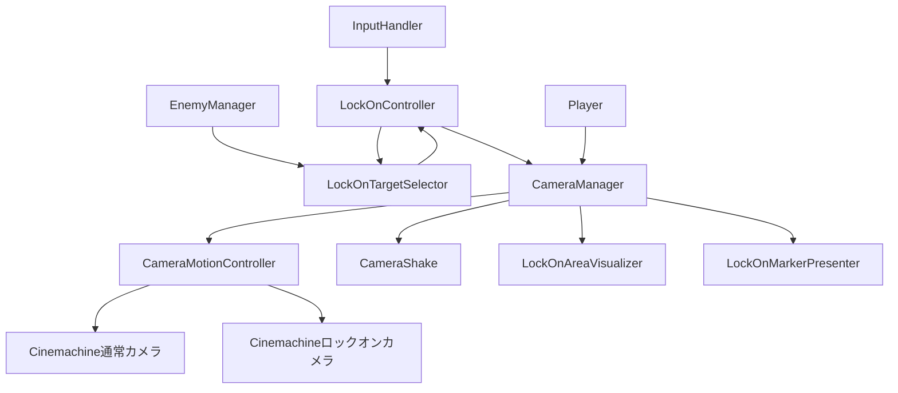

# カメラシステム概要

このフォルダには、通常時の追従カメラ、ロックオンカメラ、カメラシェイク、ロックオンUIを構成するクラスが含まれています。
カメラの状態管理は `CameraManager` が担当し、カメラの位置・回転計算、ロックオン対象の選定、入力処理は専用クラスへ分離されています。

## クラス一覧

### CameraManager

カメラシステム全体の実行主体です。`MonoBehaviour` としてシーン上に配置され、次の処理を担当します。

- 通常カメラとロックオンカメラの参照およびPriorityの管理
- ロックオン対象の保持、ロックオン開始、切り替え、解除
- ターゲットが無効になった場合や一定距離を超えた場合の自動解除
- `CameraShake` を使ったカメラシェイクの開始・強制停止
- ゲーム設定によるカメラ移動速度・回転感度の反映
- シーン切り替え後のMain Camera再取得

カメラの位置・回転計算と通常カメラへの角度引き継ぎは `CameraMotionController` に委譲します。
ロックオン対象の「どれを選ぶか」は決めず、`LockOnController` から渡された対象を使って状態を変更します。

### CameraMotionController

通常カメラとロックオンカメラの動きだけを担当する内部制御クラスです。`MonoBehaviour` ではなく、プレイヤー初期化時に `CameraManager` が生成します。

- 通常カメラの入力回転と仮想アンカーの遅延追従
- ロックオンカメラの位置追従と画面上のデッドゾーン判定に基づく回転
- ロックオン開始時の位置・回転ブレンド
- ロックオン解除時の角度を通常カメラへ引き継ぎ
- ゲーム設定変更後の通常カメラ速度更新

ロックオン対象の有効性、距離、現在のロックオン状態は保持せず、`CameraManager` から更新指示と対象Transformを受け取ります。

### CameraZoomController

通常カメラとロックオンカメラのField of Viewをまとめて補間するズーム専用クラスです。`CameraManager` が生成し、通常のカメラ追従やロックオン判定とは独立して動作します。

- `SetZoom(0f..1f)`: 通常視野から最大ズームまでを割合で指定
- `SetZoomLevel(level, maxLevel)`: チャージ段階をズーム率へ変換して指定
- `ZoomIn(amount)` / `ZoomOut(amount)`: 現在の目標ズーム率を増減
- `ResetZoom()`: 通常視野へ戻す

例えばチャージ段階の通知箇所では、`cameraManager.SetZoomLevel(level);` と呼び出せます。値の補間は `CameraManager.FixedUpdate` から自動的に実行されます。

### CameraController / LockOnController

`CameraController` はカメラ入力、敵イベント、状態遷移を担当するControllerです。既存Prefabの参照を維持するため、現在のシーン上のコンポーネント型は `LockOnController : CameraController` として残しています。

- ロックオンボタンによる開始・解除
- 左右入力によるロックオン対象の切り替え
- 敵撃破時・敵の強制削除時の次ターゲット選択
- `LockOnTargetSelector` への対象選定依頼
- 選定結果に基づく `NormalCameraState` / `LockOnCameraState` の切り替え
- `InputHandler` と `EnemyManager` のイベント購読・解除

このクラス自身は画面上の位置や距離から候補を比較しません。状態クラスと `CameraMotionController` に処理を委譲し、`CameraManager` には状態変更イベントを通知します。

### LockOnTargetSelector

ロックオン候補の取得と、候補の中から対象を選ぶ純粋な選定ロジックを担当します。`MonoBehaviour` ではなく、`LockOnController.Init` 時に生成されます。

候補は `EnemyManager.GetLockOnTarget` から取得し、次の条件で絞り込みます。

- ロックオン可能である
- ターゲット中心のTransformが存在する
- プレイヤーからロックオン可能距離以内である
- 必要に応じて現在の対象を除外する

提供する選定方法は次の3つです。

- `SelectInitialTarget`: 初回ロックオン。画面内の候補を優先し、その中でプレイヤー正面に近い対象を選びます。画面内に候補がなければプレイヤーに近い対象を選びます。
- `SelectSwitchTarget`: 左右入力による切り替え。現在対象の左右方向にある画面内候補から、画面中央に近い対象を選びます。
- `SelectNextTarget`: 現在対象が撃破・削除された後の次対象を選びます。初回選択と同じ優先順位を使います。

画面内判定にはカメラの視錐台と `Collider.bounds` を使用します。Colliderがない場合はターゲット中心を基準にした小さなBoundsを代用します。

### CameraShake / CameraShakeData

`CameraShake` はCinemachineの `CinemachineBasicMultiChannelPerlin` を操作し、一定時間だけカメラにノイズを加えます。

- `CameraShakeData`: 振幅、周期、持続時間をまとめたシリアライズ可能な設定値
- `StartCameraShake`: 対象カメラのNoiseコンポーネントを取得し、指定値でシェイクを開始
- `ForceStopCameraShake`: 実行中のシェイクをキャンセルし、Noiseの値をゼロに戻す
- 新しいシェイクを開始すると、実行中のシェイクを停止してから置き換えます

処理時間の待機にはUniTaskとCancellationTokenを使います。`CameraManager` はロックオン状態に応じて通常カメラまたはロックオンカメラを渡します。

### LockOnAreaVisualizer

ロックオン判定のデッドゾーンを画面中央の円として表示するUIコンポーネントです。

- `CameraManager.LockOnAreaRadius` を直径に変換してUIサイズへ反映
- 未ロックオン時とロックオン時で表示色を変更
- `_showArea` による表示・非表示
- 必要なCanvas、Image、円形Spriteを実行時に生成
- エディタ上でも値変更時に円のサイズを更新

ロックオン判定そのものは行わず、`CameraManager` が持つ設定値と状態を表示するだけです。

## 主要な連携

## ロックオン開始から解除まで

1. `InputHandler` がロックオン入力イベントを発行します。
2. `LockOnController` が `LockOnTargetSelector.SelectInitialTarget` を呼び出します。
3. 選ばれた対象を `CameraManager.LockOn` に渡します。
4. `CameraManager` が対象を保持し、ロックオンカメラのPriorityを上げてブレンドを開始します。
5. ブレンド完了後、対象の画面位置に応じてカメラを回転し、プレイヤーを基準に位置を追従します。
6. 対象の無効化、撃破・削除、または自動解除距離超過が起きると、次対象への切り替えまたは解除を行います。
7. 解除時は現在のカメラ角度を通常カメラへ引き継ぎ、ロックオンカメラのPriorityを下げます。

## 参照関係と責務の境界

| クラス | 主な責務 | 主な依存先 |
| --- | --- | --- |
| `CameraManager` | カメラ状態、切り替え、ライフサイクル | Cinemachine、Player、InputHandler、LockOnController、CameraMotionController |
| `CameraMotionController` | 通常・ロックオンカメラの位置、回転、ブレンド | Cinemachine、Player、InputHandler |
| `CameraController` | 入力・敵イベントとカメラ状態の遷移 | InputHandler、EnemyManager、LockOnTargetSelector、CameraManager |
| `LockOnController` | 既存Prefab向けの互換コンポーネント | CameraController |
| `LockOnTargetSelector` | ロックオン候補の絞り込みと選定 | EnemyManager、Camera、Player |
| `CameraShake` | Cinemachine Noiseの一時操作 | Cinemachine、UniTask |
| `LockOnAreaVisualizer` | デッドゾーンの画面表示 | CameraManager、Unity UI |
| `ILockOnTarget` | ロックオン対象の共通契約 | 実装側のターゲット中心Transform |

## 実装上の注意

- シーン上の初期化順に依存するため、`CameraManager.Init(Player)` が呼ばれてからロックオン入力を扱える状態になります。
- `CameraManager` は通常カメラ、ロックオンカメラ、ロックオンコントローラーの参照が不足すると初期化を中断します。
- `LockOnController` は `EnemyManager` のイベントを購読するため、破棄時の購読解除が必要です。現在は `OnDestroy` で解除しています。
- `LockOnTargetSelector` は画面判定に `_camera` と `Screen.width` / `Screen.height` を使うため、カメラや画面状態が未準備の場合は正しく選定できません。
- `LockOnController.cs` はクラス名とファイル名を一致させています。Unityスクリプトをリネームする場合は、既存のMetaファイルのGUIDを維持してください。